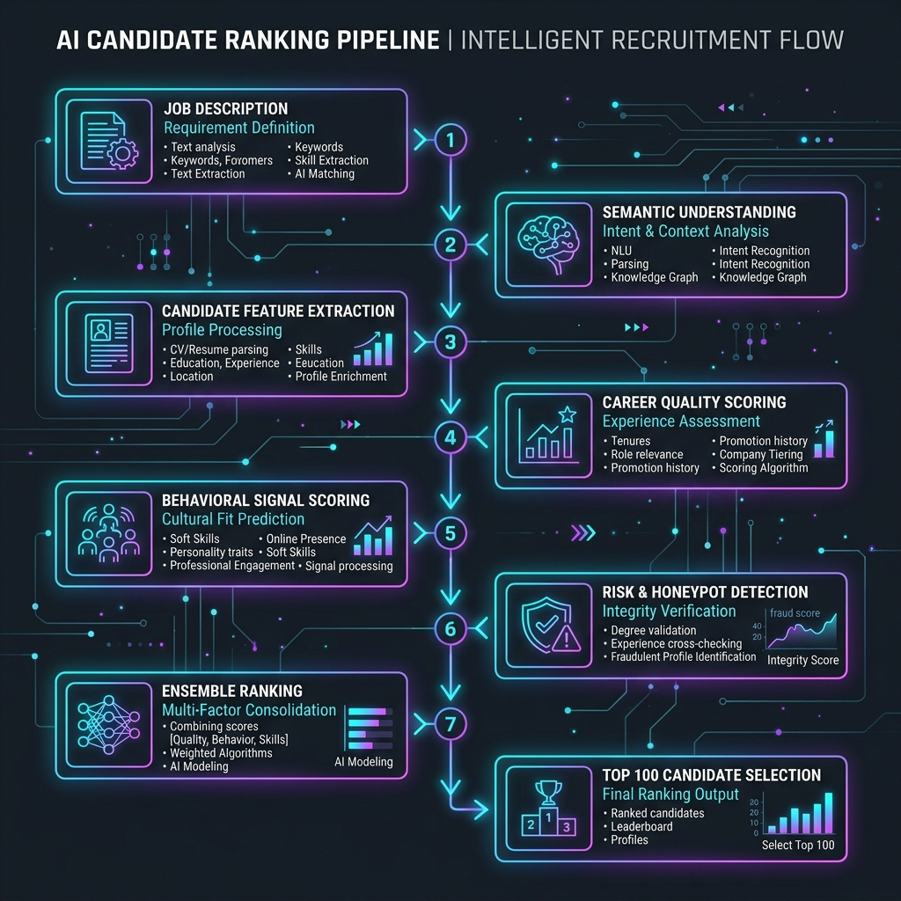
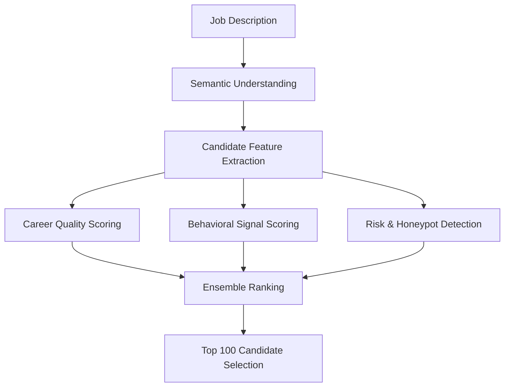

# Candidate Ranking Pipeline Architecture

This document outlines the pipeline architecture for the Redrob Intelligent Candidate Discovery & Ranking system.

## Visual Pipeline Diagram

## Architecture Workflow

### Components

1. **Job Description**: The target job spec containing required/preferred skills, target experience level, and service-firm exclusions.
2. **Semantic Understanding**: Parses the JD to extract core AI/ML terms, production signals, retrieval/search signals, and target keywords.
3. **Candidate Feature Extraction**: Streams the raw profile JSON schema to extract career timeline, skills, experience duration, and activity signals.
4. **Career Quality Scoring**: Evaluates candidate pedigree, relevance of past titles, duration at target product companies, and AI tool expertise.
5. **Behavioral Signal Scoring**: Analyzes interaction metrics (recruiter response rate, interview completion rate, GitHub activity, and profile completeness).
6. **Risk & Honeypot Detection**: Identifies anomalies (e.g. impossible timelines, skill duration mismatches, keyword stuffing, services firm mismatches) and assigns risk verdicts (`CLEAN`, `SUSPICIOUS`, `LIKELY_TRAP`, `CONFIRMED_TRAP`).
7. **Ensemble Ranking**: Merges the Quality and Behavioral scores while penalizing candidates flagged by Risk Detection.
8. **Top 100 Candidate Selection**: Filters down to the best 100% clean, hireable candidates sorted strictly in descending order of quality score.
